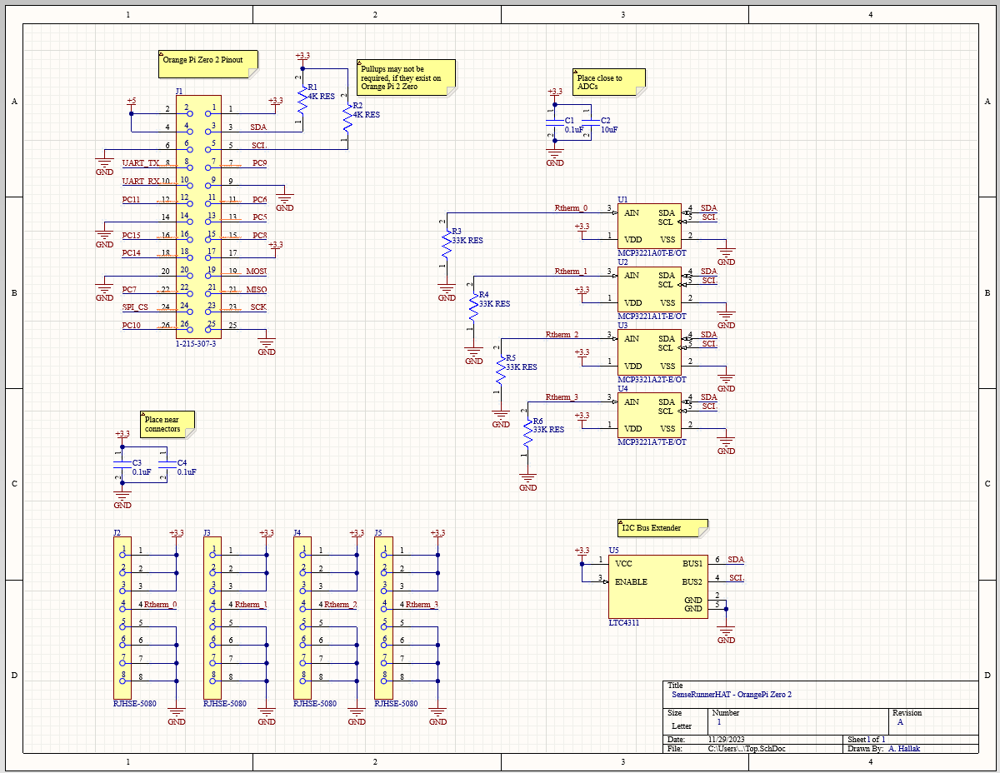

Amjed Hallak

Elkton, MD · linkedin.com/in/amjed-hallak/ · github.com/ahallak

Temp Sense Runner

Compressors in Heating, Ventilation, and Air Conditioning (HVAC) systems are historically subject to common failures, often due to mechanical wear and tear or electrical failures. Compressor failure often results in failing refrigerators, freezers, and home or business temperature regulation.

Findings from regular technicians in the field have resulted that compressor failures can be identified either before total failure of temperature regulation or before refrigerator or freezer temperatures ascend too high.

Methodology

Simple thermistors can be placed among different compressor pipes. Tewa makes thermistors that are relatively easy to strap onto copper compressor inlet/outlet pipes. By enabling hardware to discretize Analog-to-Digital (ADC) reads from multiple thermistors, compressors may be tracked. The data tracking is then fed telemetrically to an operator or technician on a regular period to assess and analyze the current state of the compressor.

Implementation

A single-board computer (SBC), the Orange Pi Zero 2 was selected as a viable candidate for facilitating the coÍmputational operations of the system A custom daughterboard ("Hat") was designed using Printed Circuit Board (PCB) software. The schematic describes the operational circuitry to digitize analog values from up to 4 thermistors. The circuit is sampled by the Orange Pi Zero 2 using the Inter-Integrated Circuit (I²C, I2C) bus. The I²C bus contains open-drain digital transitions to bidirectionally communicate 1s and 0s between a host and multiple peripheral chips, each with a unique address. The open-drain architecture is improved with an LTC4311, functionally dumping current onto a bus it detects is being "pulled high" by a resistor in order to stabilize the bus and increase the bus stability as frequency increases. The carrier board was then routed with through-hole parts in mind in order to allow for simple hand-soldering of most components. Being an at-home prototype, this results in a relatively high cost saving operation at the expense of a few minutes of soldering. Not all parts were through hole, but a fine-tipped soldering iron and a bit of magnification made the process of soldering the ADCs and LTC4311 relatively straightforward. RJ-45 connectors are used as a quick and low cost solution allowing the thermistor to be run over a standard cable that can be bought off the shelf - even most, if not all (untested) categories of Ethernet cables, where the thermistor is spliced onto specific pins.

A canned implementation of Ubuntu Jammy was installed onto the SBC, and configured to automatically start a configurable software application that reads in a few hand-editable configurations to edit the sample averaging, the sample rate, the telemetric frequency, and destination emails for the telemetry. The SMTP library is utilized to send telemetry to operators and technicians. Within the telemetry, raw data is presented as well as a QuickChart.io generated by the QuickChart.io API. The telemetry contains a converted thermistor reading to a temperature based on a lookup table provided by Tewa, a time stamp, and a date stamp. The chart is a combined line plot of all 4 probes connected to the RJ-45 receptacles. In addition, all telemetry files are saved locally as a text file in a data folder for where the network configuration is insufficient to run this device.

Results, Findings, and Challenges

Ultimately, the intended function of the device came to fruition. This device was deployed to two restaurants in Delaware to monitor a dessert cooler, and an actively failing HVAC unit.

The chart above illustrates actual data pulled off from multiple probes attached to a dessert refrigerator in a local restaurant. The compressor appears to be cycling, with wider cycles during peak hours where the refrigerator is often being restocked. Actual timestamps are embedded in the data as well. The telemetry, illustrated on the left, represents some of the raw data, as well as a QuickChart link to visualize the data with discrete timestamps. The telemetry and sample frequency was set as requested by the HVAC technician.

Serving this unit in the field is best done over SSH, but in common commercial scenarios where such access is unavailable, UART can be utilized instead. By breaking out a dedicated set of UART lines from the SBC, one is able to plug into the device with a laptop nearby and monitor functions or reconfigure the device. Future plans involve either SMTP commands over email, or a REST API if commercial scenarios will allow for such a thing given the heightened security risk. Preparing this device for bulk production would involve a restructure of the software to allow for multiple users and a more robust monitoring setup. In addition, cheaper SBCs may be utilized, and part life cycles would have to be considered. 

